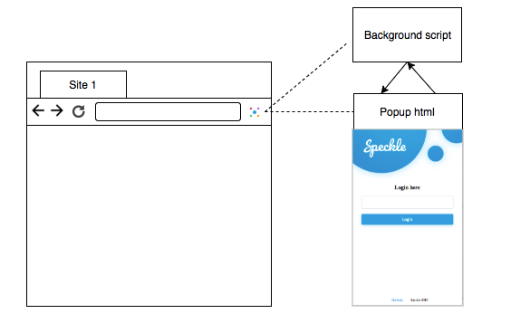

# Speckle Development Document

### Overview

Speckle browser extension works on Chrome, Brave and Firefox. It uses ‘Web-Extension Polyfill for TypeScript’ (webextension-polyfill-ts) to abstract extension API calls for different browsers.

As a normal browser extension, it is made of different, but cohesive components. They include background scripts, a popup page, an options page, UI elements and various logic files. At the moment, the most logic of Speckle browser extension exists in the popup page that interacts with the background script. Browser local storage is also used to store necessary settings and encrypted keystore.

<p align='center'></p>

### Account Management

Speckle relies on Polkadot Keyring to implement account generation, and uses browser extension  storage to implement account persistence. We adopts sr25519 as our default keyring type, as we plan to implement BIP44 HD wallet in future and ed25519 is not recommended for BIP44 HD wallet. For the same reason, we use BIP39 mnemonic as seed generation mechanism.

Currently Speckle has implemented a simple wallet. Even though it will support multiple accounts (keypairs), each account will be independent, which means they have to be backed up individually. It depends on HD wallet development progress, we may replace simple wallet with HD wallet before production release.

As Polkdadot Keyring implementation does not expose private key, Speckle does not support raw private key backup like Metamask. It only supports mnemonic backup (before account generation) and keystore backup (after account generation).

User can import account in two ways, 12 word seed phrase and keystore file. When importing account by keystore file, the password has to be supplied to decrypt it. Both ed25519 and sr25519 accounts are supported. The accounts generated in Polkadot PoC-2 and before can also be imported.

### Security Mechanism

* Extension storage instead of local storage is used to persist encrypted accounts.
* Password is enforced to be at least 8 characters
* Account imported from un-encrypted keystore will be encrypted using user's password before persisting into storage
* No passowrd or mnemonic is persisted anywhere.

### Balance Component

Speckle shows account balances by subscribing freeBalance update from Polkadot (or any Substrate) node's Websocket rpc endpoint. It unsubsribe the update once upon the address changes. This way balance keeps up-to-date.

### Code Reading Guide

The code is organised by folders and the folder names describe what are inside them, e.g. components, services, etc.
The account management service is in `/src/ts/background/services/keyring-vault.ts` file. It is responsible for mnemonic generation, account generation, keystore file generation, account persistence and account loading from storage.

`src/ts/services/keyring-vault-proxy.ts` is a service proxy to `keyring-vault.ts` to hide messaging complexities from front end.

`/src/ts/routes/RouteWithLayout.tsx` is a HOC (high order component) which can be used to define Routes using different Layouts. `/src/ts/layouts` contains two Layout components, `LoginLayout.tsx` is a container component which defines a common header and footer for screens before user unlocks the wallet, `DashboardLayout.tsx` is a container component which define a common header and footer for dashboard screens after user unlocks the wallet.

### Code Snippets

//background listens to the port
```
browser.runtime.onConnect.addListener(function (port) {
  if (port.name !== '__SPECKLE__') return
  port.onMessage.addListener(function (msg) {
    switch (msg.method) {
      case FUNCS.LOCK:
        keyringVault.lock()
        port.postMessage({ method: FUNCS.LOCK, result: true })
        Break
...        
```

//popup service trigger message event
```
const port = browser.runtime.connect(undefined, { name: '__SPECKLE__' })

export function lockWallet (): Promise<boolean> {
  return new Promise<boolean>((resolve, reject) => {
    port.onMessage.addListener(msg => {
      if (msg.method !== FUNCS.LOCK) return
      if (msg.error) {
        reject(msg.error.message)
      }
      resolve(msg.result)
    })
    port.postMessage({ method: FUNCS.LOCK })
  })
}
```

// component calls service
```
  handleLockClick = () => {
    lockWallet().then(result => {
      console.log(result)
    })
  }
```


